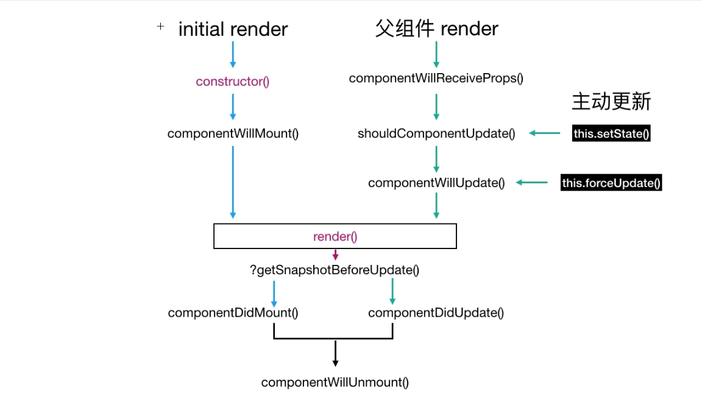
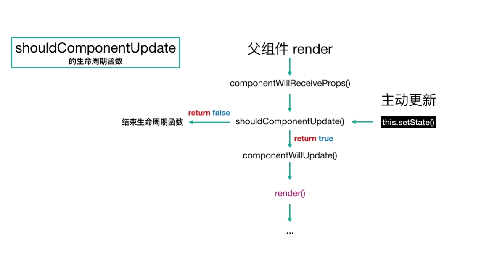
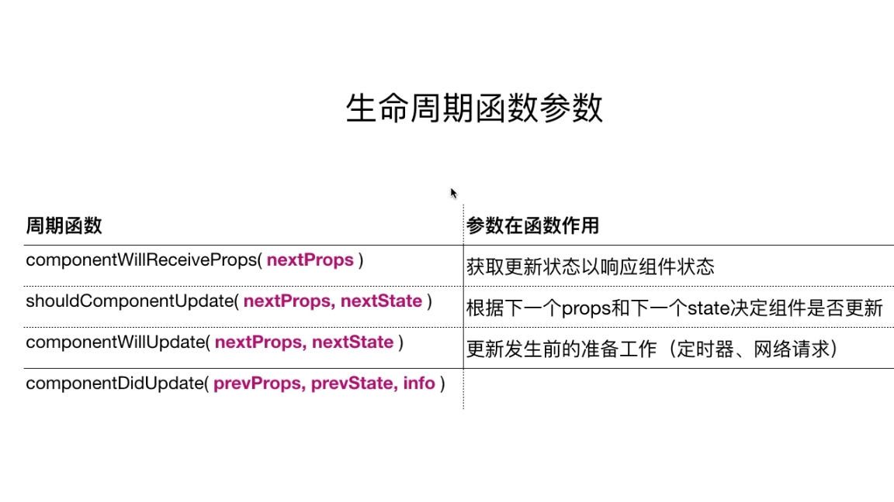
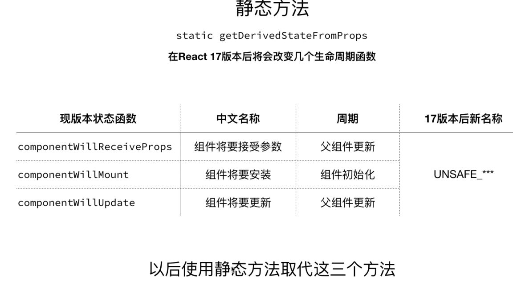
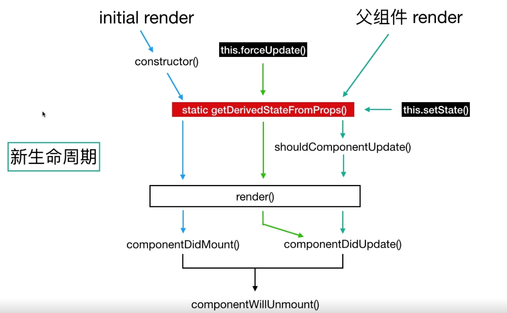

> 生命周期
1. 生命周期函数： 
React组件不是真正的DOM，而是会生成虚拟的DOM
虚拟DOM会经历一个创建，更新，删除的过程

有3中更新：this.setState()
            强制更新
            父组件更新带动子组件更新

2. 生命周期流程
//组件加载过程：
constructor 
组件将要加载 - componentWillMount 
render 
组件已经加载 - componentDidMount

//setState
组件是否更新 - componentWillUpdate
组件将要更新 - componentWillUpdate
render
 组件已经更新 - componentDidUpdate

//forceUpDate - 强迫更新
组件将要更新 - componentWillUpdate
render
组件已经更新 - componentDidUpdate

//父组件带动子组件更新过程
组件将要接受参数 - componentWillReceiveProps
组件是否更新 - componentWillUpdate
组件将要更新 - componentWillUpdate
render
 组件已经更新 - componentDidUpdate

 //卸载
 组件将要卸载 - componentWillUnmount

 
 

3. 生命周期函数参数

4. 新生命周期函数 17版本

******
1. react中什么是静态类型的属性检查

2. {Component} 别忘记大写

3. Objects are not valid as a React child (found: Sat Apr 06 2019 17:04:55 GMT+0800 (中国标准时间)). If you meant to render a collection of children, use an array instead.

4. 生命周期函数，钩子？

5. es6 static关键字  - 用在class中为对象添加静态方法

6. 新生命周期函数 17版本