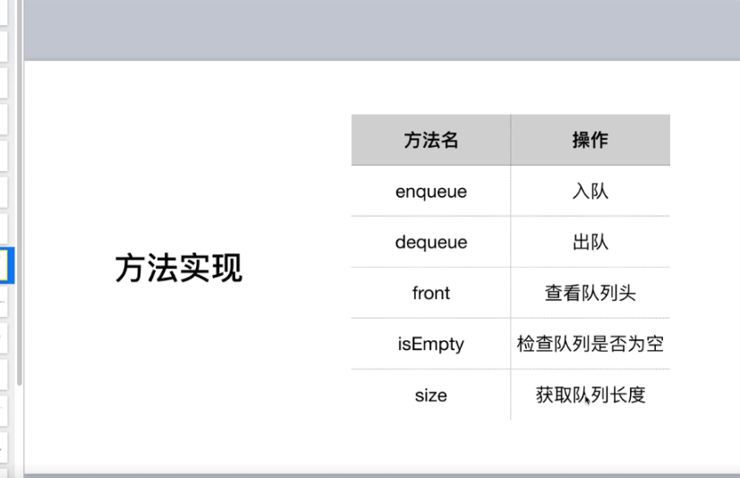

>队列(queue)

**一种 先进先出 的数据结构** -- 与栈刚好相反

1. 操作方法

    `shift()`  
    `unshift()`

2. 循环队列和击鼓传花

    思想： 
    `arr.shift()` 出队列  --> 放到队列后面 `arr.push(arr.shift())`
    
    其中的循环要弄清楚`while(){}`

3. 优先队列和辅助类（./2.js）
    `splice()`  操作数组的另一个强大的方法，删除，替换，增加