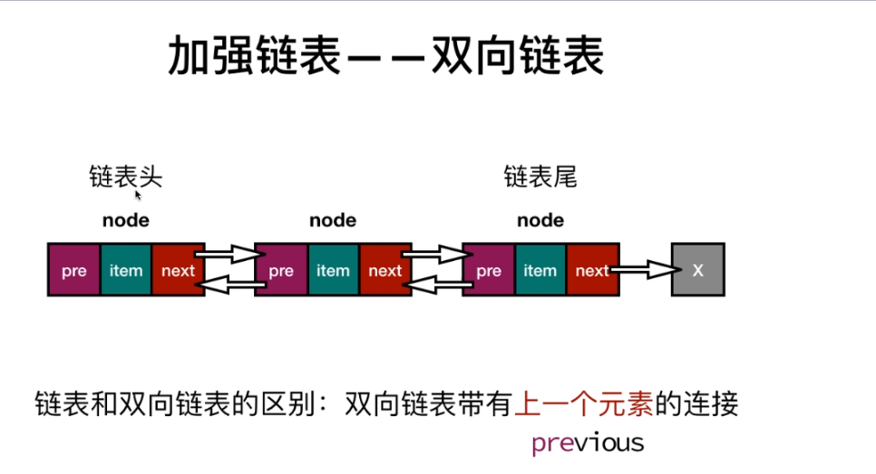
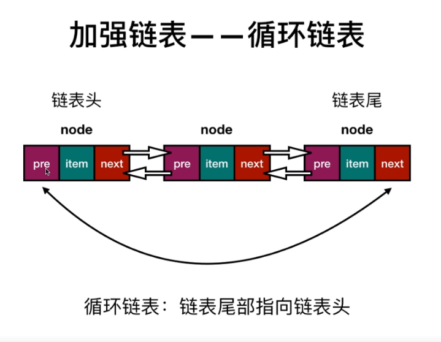

> 链表

**每个元素都带有下一个元素的位置**

*链表就像一列火车，每一列不仅携带自己的乘客（items），还得与下一节火车相连*
1. 链表概念，链表结构，实现append方法

    链表头

    链表尾

    手动记录length，head(链表头)

2. 链表插入的条件分析和实现

3. 链表删除条件分析，条件复用

    移除的东西一定要`return `

    代码复用 
        `remove() --> indexOf() + removeAt() `

4. 其他链表

    双向链表

    
    
    双向循环链表

    
