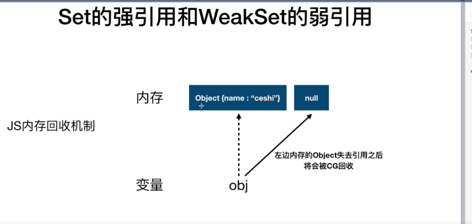
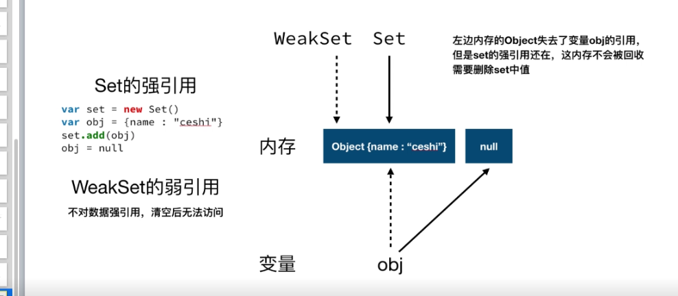

> 5 集合 -- set

特点：**无重复**

Object 类型  ————  key == value

1. 集合类结构和方法
+ hasOwnProperty()  -- 可以检测属性存在于实例中还是原型中。

    实例中  -- true

    原型中 -- false
+ delete -- 删除对象的某个属性
+ 对象语法有两种形式

   **点语法**   key 只能是object 的 key ,不能是变量

    **方括号语法**  key 可以是变量

    ```javascript
    var obj = {name: 20}
   console.log(
       obj.name ,   //20
       obj["name"]   //20   注意： 别忘记加 双引号
   )       

   var key = "name"
   console.log(
       obj.key ,   //undefind
       obj[key]   //20
   )  
    ```

+ 构造器的方法称之为 静态方法？


2. 集合实现和ES对象操作和静态方法讲解

3. 并集，交集，差集实现

4. es6的集合，Set , WeakSet
    es6 内置新数据结构  Set / WeakSet

    WeakSet  只能添加Object类型

    解构 (数组，集合) ...

5. Set方法和es6 lambda简化、强引用和弱引用
    箭头函数若是只有 一行代码 ，可以将花括号{} 省去。

        若是只有一个参数 可以讲小括号 ()  省去
    
    Set的强引用 与 weakSet 的弱引用

        js垃圾回收机制 内存

        强引用 ：失去引用后，内存不会被回收。除非用delete 删除 Set

        弱引用 ： 失去引用后，内存会被回收
    
     