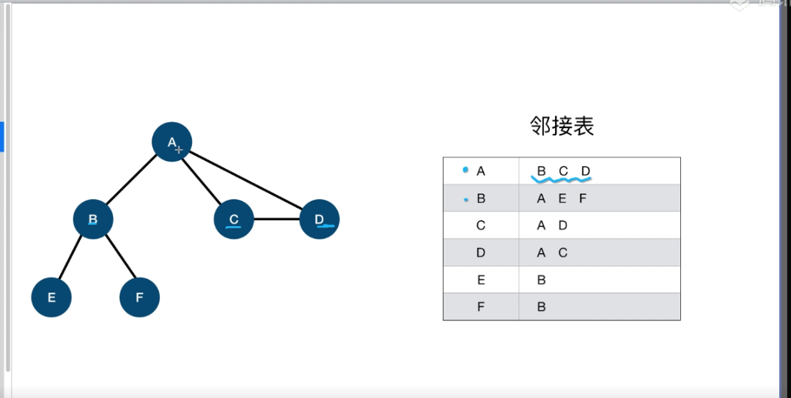

> 图
图是计算机中使用广泛的一种结构

可以做地图，社交网络
1. 图的一些基本概念

    有向图

    无向图

    邻接矩阵  -- 非常浪费计算机内存

    
    邻接表    
    
    

2. 图遍历

    广度优先 -- 队列   优先遍历图的横向
    其有天然的优势，回溯点可以直接确定最小路径。深度优先遍历做不到；

    深度优先  -- 递归   优先遍历图的纵向  有点像树的感觉

    递归 -- 要想清楚出栈，进栈过程